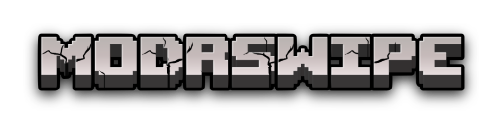

<div align="center">
  
  <p>
    Decide on your next game mods with a fun, real-time swiping experience.
  </p>
</div>

---

**ModrSwipe** is a real-time, collaborative web application designed to help groups of friends democratically decide which game mods to play together. It provides a "Tinder-like" swiping interface for voting on proposed mods, making the decision process fast, fun, and transparent.

For a detailed explanation of the project's architecture, data models, and service layer, please see the **[Full Technical Documentation](./docs/TECHNICAL_DOCUMENTATION.md)**.

## ✨ Key Features

- **🚀 Real-Time Rooms:** Create private rooms and invite friends with a unique code.
- **👥 Live Player List:** See who's online in the lobby.
- **💡 Mod Proposals:** Any member can propose mods for the group to vote on.
- **↔️ Swipe to Vote:** A fun, intuitive swiping interface for "Like" (right) or "Pass" (left).
- **📊 Live Results:** Instantly see which mods won the vote once the session ends.

## 🚀 Getting Started

Follow these instructions to get a local copy of the project up and running.

### Prerequisites

- [Node.js](https://nodejs.org/) (v18 or newer)
- [NPM](https://www.npmjs.com/)
- A Firebase project

### Installation & Setup

1.  **Clone the repository:**
    ```bash
    git clone https://github.com/jerkey06/ModrSwipe.git
    cd ModrSwipe
    ```

2.  **Install dependencies:**
    ```bash
    npm install
    ```

3.  **Configure Environment Variables:**
    Create a `.env.local` file in the project root and add your Firebase project configuration. You can get these from your Firebase project settings.

    ```env
    VITE_FIREBASE_API_KEY=your-api-key
    VITE_FIREBASE_AUTH_DOMAIN=your-auth-domain
    VITE_FIREBASE_DATABASE_URL=your-database-url
    VITE_FIREBASE_PROJECT_ID=your-project-id
    VITE_FIREBASE_STORAGE_BUCKET=your-storage-bucket
    VITE_FIREBASE_MESSAGING_SENDER_ID=your-messaging-sender-id
    VITE_FIREBASE_APP_ID=your-app-id
    ```

4.  **Run the development server:**
    ```bash
    npm run dev
    ```
    The application should now be running on `http://localhost:5173`.

### Available Scripts

- `npm run dev`: Starts the development server.
- `npm run build`: Builds the app for production.
- `npm run lint`: Lints the code using ESLint.
- `npm run test`: Runs the unit tests with Vitest.
- `npm run preview`: Serves the production build locally.

## 📄 License

This project is licensed under the MIT License. See the `LICENSE` file for details.
